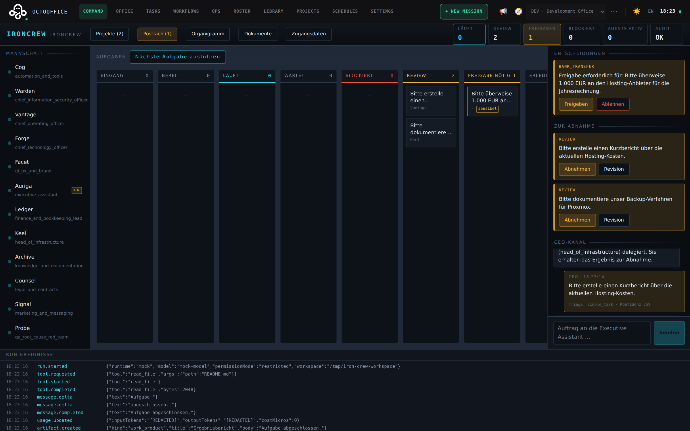
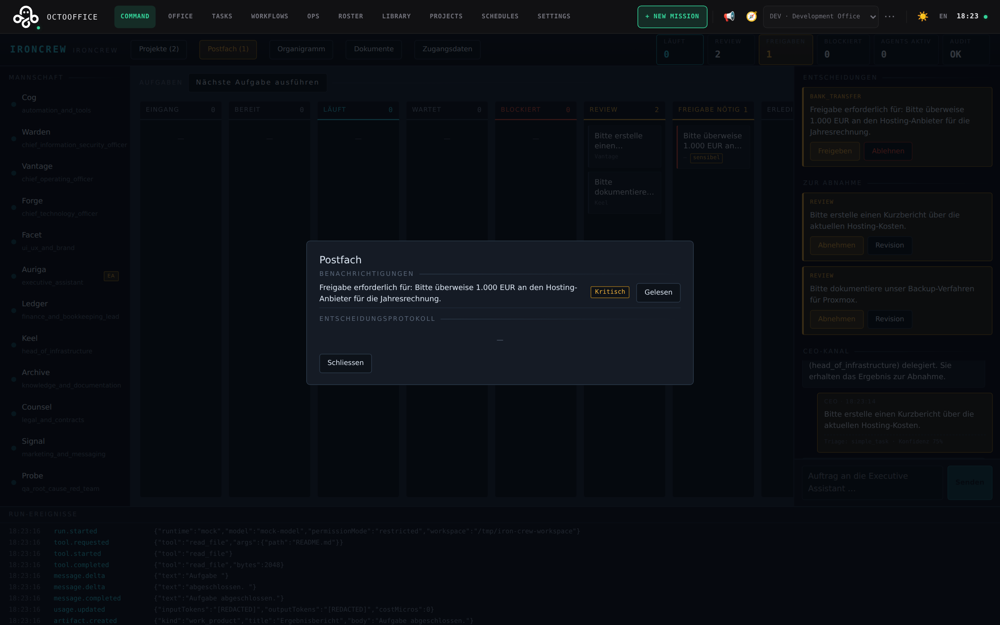
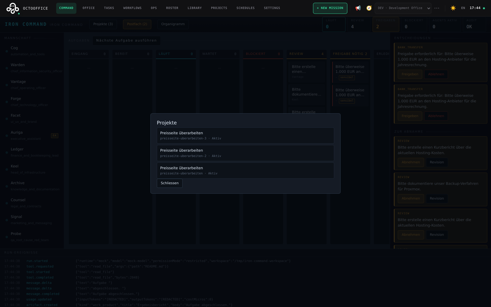
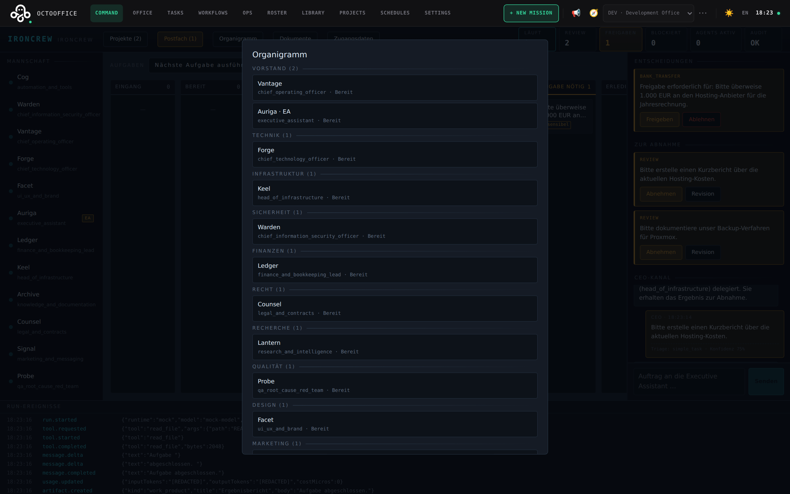
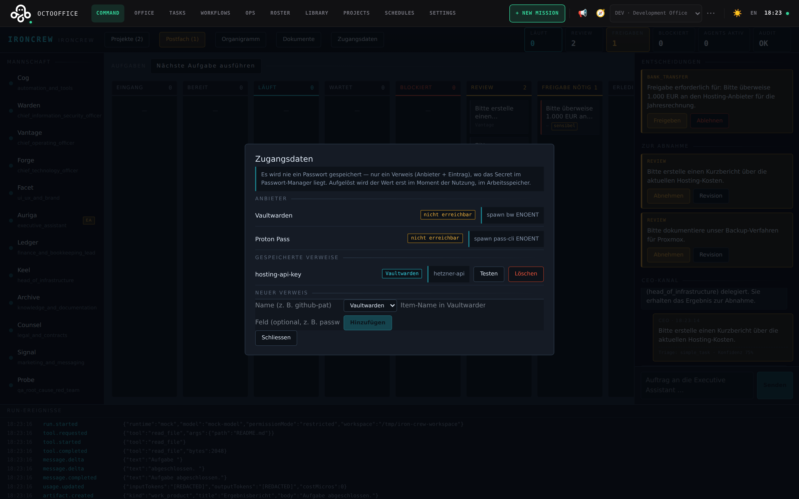

# IronCrew

A self-hosted, local-first **multi-agent company OS**. You are the owner and
CEO. You talk to one Executive Assistant, who triages, plans, delegates to a
crew of specialist agents, and reports back with a result you accept or send
for revision.

Built as a fork of [OctoOffice](https://github.com/Chepko932/OctoOffice)
(Apache-2.0), with a governance-grade control plane added alongside it:
atomic task claiming, an approval engine that technically blocks high-risk
actions, budget enforcement, a hash-chained audit log, and a vendor policy that
is enforced in the backend rather than hidden in the UI.

> **Status: Phases 0–5 shipped.** On top of the Company OS slice (goals,
> projects, Kanban, meetings, an Obsidian memory, Discord/Telegram/email) the
> system now has a tool register with risk classes, an MCP scope per agent and
> project, a separate runner daemon, real accounts with roles and sessions,
> five business packs behind seven read-only integrations, four-eyes approvals,
> OIDC beside the password login, and an audit chain that is copied off the box
> — **5,378 tests** across the server, client and operations-script suites.
>
> Two things are deliberately not built and say so: multi-company, and a
> PostgreSQL adapter. One thing is built but not reachable — sandbox
> elevation can be granted and read, but nothing can raise the approval that
> would mint it, so every run resolves `restricted`. It fails safe.
> [`IMPLEMENTATION_STATUS.md`](IMPLEMENTATION_STATUS.md) has the honest,
> test-backed breakdown; [`docs/ROADMAP.md`](docs/ROADMAP.md) has the reasoning
> for the two that were refused.

## Quick start

```bash
git clone https://github.com/irongeeks/ironcrew.git
cd ironcrew
pnpm install
cp .env.example .env          # set API_AUTH_TOKEN to a long random value
pnpm dev                      # http://127.0.0.1:8800
```

Complete the setup wizard, then open the **COMMAND** tab.

No provider login is required to try it — MockRuntime exercises the whole flow.
Full instructions: [Linux](docs/LINUX_INSTALL.md) · [macOS](docs/MACOS_INSTALL.md).

## What it does

```text
CEO ──► Executive Assistant ──► triage ──► task ──► delegation
                                                       │
                                                       ▼
                                    agent + runtime ──► run events
                                                       │
CEO ◄── summary ◄── review ◄────────────────────────────┘
```

- **One point of contact.** You write to the EA. She classifies every message
  (question, task, project, incident, sensitive request…), asks only when the
  signal is genuinely weak, and delegates by department.
- **Sensitive work is blocked, not executed.** A payment, a tax filing, a
  contract, a production deployment — the EA creates an approval request and
  says plainly that she has _not_ acted. Only you decide.
- **Everything is on the record.** One correlation id spans your message, the
  task, every run, every event and every audit entry — and the record is
  hash-chained, verifiable offline, and copied somewhere this machine's owner
  cannot reach.
- **The dangerous decisions can need two people.** Any approval can be raised
  to a quorum: N approvals to proceed, **one rejection to stop**. A quorum can
  never be lowered again, because a control the compromised account can undo
  is not a control.
- **A trade, not just a company.** A business pack adds the departments, posts,
  tools and routines one trade needs — MSP, web agency, German finance, German
  legal, knowledge work. It registers tools; it never grants them, and its
  routines install switched off.

## Screenshots

The Command Center — a live Kanban board, decision inbox and CEO chat, all
backed by the same REST API this README describes elsewhere:



<details>
<summary>More views (decision inbox, projects, org chart, secrets)</summary>

Decision inbox — notifications and the append-only decision log:



Projects, traced back to the goal they serve:



Org chart, grouped by department:



Password-manager integration — only ever a reference (provider + item), never
a value; the "nicht erreichbar" badges here are honest, since neither `bw`
nor `pass-cli` is installed on this particular machine:



</details>

## Design commitments

These are enforced in code and covered by tests, not just documented.

| Commitment                     | How                                                                                                                                                                                                                                                                                         |
| ------------------------------ | ------------------------------------------------------------------------------------------------------------------------------------------------------------------------------------------------------------------------------------------------------------------------------------------- |
| **Policy beats persona**       | Persona, professional role and policy are three separate columns. A character pack may change display name and portrait — nothing else. Attempts to reach policy through a skin are rejected loudly.                                                                                        |
| **No agent approves anything** | `may_approve` is typed as the literal `false`. Approval is the human owner's alone.                                                                                                                                                                                                         |
| **No double work**             | Task claiming is a compare-and-set on `status_version`; exactly one of N concurrent workers wins. Verified with a 25-way concurrency test.                                                                                                                                                  |
| **No unbounded agents**        | CLI permission bypass flags are never default, with a guard immediately before `spawn()`. `elevated` requires an owner-approved, ≤4h sandbox grant — and since nothing can currently raise that approval, every run resolves `restricted`. Stated plainly rather than described as working. |
| **No secrets in logs**         | Redaction sits in the logger itself, not at the call site: every log object and message string is scrubbed before it reaches stdout, the `logs` table or the WebSocket stream. Also across stdout chunk boundaries.                                                                         |
| **Deny by default**            | Vendor policy and per-agent tool access both refuse anything not explicitly allowed. The blocklist always beats the allowlist.                                                                                                                                                              |
| **No invented numbers**        | Every dashboard figure names its source and read time. Subscription runtimes record quota events, not a fabricated price.                                                                                                                                                                   |
| **No silent failure**          | A rate limit is its own event, not a generic error. A budget stop is HTTP 402; an approval block is 403. The UI shows both.                                                                                                                                                                 |
| **Tamper-evident record**      | The audit log is append-only and hash-chained; `verifyAuditChain()` locates the first broken link, and `pnpm run audit:verify:db # verify the audit chain offline, read-only, no server                                                                                                     |

node scripts/ironcrew-migrate.mjs status # which migrations are applied, which are pending
node scripts/ironcrew-migrate.mjs check # refuse an older build on a newer schema (own exit code)
node scripts/ironcrew-backup.mjs --out backups --keep 7 # snapshot a running database, with a manifest
node scripts/ironcrew-backup.mjs --inspect <archive> # read the manifest, touch nothing
node scripts/ironcrew-backup.mjs --restore <archive> # restore, refusing to overwrite without --force
node scripts/ironcrew-load-test.mjs # "does this box hold my company?", below the routes

```bash
pnpm dev            # development server with hot reload
pnpm test           # unit and integration tests
pnpm test:api       # server suite
pnpm test:web       # frontend suite
pnpm test:e2e       # Playwright
pnpm build          # type check and bundle
pnpm lint
```

Operations — these run against a real database and are meant for the machine
the company lives on:

```bash
pnpm run audit:verify:db                  # verify the audit chain offline, read-only, without the server
node scripts/ironcrew-migrate.mjs status  # which migrations are applied, which are pending
node scripts/ironcrew-migrate.mjs check   # refuse to start an older build on a newer schema (own exit code)
node scripts/ironcrew-backup.mjs --out backups --keep 7   # snapshot a running database, with a manifest
node scripts/ironcrew-backup.mjs --inspect <archive>     # read the manifest, touch nothing
node scripts/ironcrew-backup.mjs --restore <archive>     # restore, refusing to overwrite without --force
node scripts/ironcrew-load-test.mjs                      # "does this box hold my company?", below the route layer
```

`audit:verify:db` opens the database read-only and walks every company's chain
to the end. It exits **2** on a broken link _or a hole_ — a chain that is
internally consistent because entries were removed is not an intact chain.

## Documentation

| Document                                                                                            | Contents                                                                                   |
| --------------------------------------------------------------------------------------------------- | ------------------------------------------------------------------------------------------ |
| [`IMPLEMENTATION_STATUS.md`](IMPLEMENTATION_STATUS.md)                                              | what is built, what is not, with test evidence                                             |
| [`docs/ARCHITECTURE.md`](docs/ARCHITECTURE.md)                                                      | layers, module map, invariants, data flow                                                  |
| [`docs/UPSTREAM_ANALYSIS.md`](docs/UPSTREAM_ANALYSIS.md)                                            | what was taken from OctoOffice, OneManCompany and Paperclip, and what was deliberately not |
| [`docs/THREAT_MODEL.md`](docs/THREAT_MODEL.md)                                                      | trust boundaries, findings, mitigations, residual risk                                     |
| [`docs/DATA_MODEL.md`](docs/DATA_MODEL.md)                                                          | schema and why it is shaped that way                                                       |
| [`docs/PROVIDER_AUTH.md`](docs/PROVIDER_AUTH.md)                                                    | runtime authentication and permission modes                                                |
| [`docs/IDENTITY.md`](docs/IDENTITY.md)                                                              | accounts, roles, sessions — and whose name the audit log carries                           |
| [`docs/VESSELS_TALENTS.md`](docs/VESSELS_TALENTS.md)                                                | an agent is a Vessel × Talent — and what a vessel deliberately cannot grant                |
| [`docs/RUN_QUEUE.md`](docs/RUN_QUEUE.md)                                                            | the durable queue between "this should run" and "this is running"                          |
| [`docs/SERVICE.md`](docs/SERVICE.md)                                                                | running as a systemd service, and the scheduler that works while nobody watches            |
| [`docs/MAIL.md`](docs/MAIL.md)                                                                      | mailboxes, per-agent grants, and why incoming mail is never a CEO message                  |
| [`docs/MESSENGER.md`](docs/MESSENGER.md)                                                            | two-way Telegram/Discord, pairing, and who may speak as the CEO                            |
| [`docs/CHANGE_PROPOSALS.md`](docs/CHANGE_PROPOSALS.md)                                              | an agent proposes file changes, the owner approves, then they apply                        |
| [`docs/MARKETPLACES.md`](docs/MARKETPLACES.md)                                                      | installing skills and MCP servers, and the trust boundary that gates it                    |
| [`docs/NETWORKING.md`](docs/NETWORKING.md)                                                          | Tailscale/Headscale status + remote workers over the tailnet                               |
| [`docs/RUNNER_PROTOCOL.md`](docs/RUNNER_PROTOCOL.md)                                                | the runtime interface and event model                                                      |
| [`docs/BUSINESS_PACKS.md`](docs/BUSINESS_PACKS.md)                                                  | the five trades, their posts and tools, and the read-only adapters behind them             |
| [`docs/AUDIT_SHIPPING.md`](docs/AUDIT_SHIPPING.md)                                                  | shipping the audit record off the box, and what the cursor guarantees                      |
| [`docs/BACKUP.md`](docs/BACKUP.md)                                                                  | snapshots of a running database, restore, and what a manifest is for                       |
| [`docs/UPGRADE.md`](docs/UPGRADE.md)                                                                | upgrading, schema checks, and rolling back without corrupting the database                 |
| [`docs/TOOLS.md`](docs/TOOLS.md)                                                                    | the tools an agent can hold, and how each one is granted                                   |
| [`docs/ROADMAP.md`](docs/ROADMAP.md)                                                                | what comes next                                                                            |
| [`docs/LINUX_INSTALL.md`](docs/LINUX_INSTALL.md) · [`docs/MACOS_INSTALL.md`](docs/MACOS_INSTALL.md) | installation                                                                               |
| [`docs/UPSTREAM_README.md`](docs/UPSTREAM_README.md)                                                | the original OctoOffice README, for inherited features                                     |

## Licence and attribution

Apache-2.0. IronCrew is a fork of OctoOffice, Copyright (c) Joshua
Dormann, used under Apache-2.0 with the licence preserved.

See [`THIRD_PARTY_NOTICES.md`](THIRD_PARTY_NOTICES.md) for the full attribution,
the list of modified files, and what was learned (but not copied) from
OneManCompany, Paperclip and Honcho.
