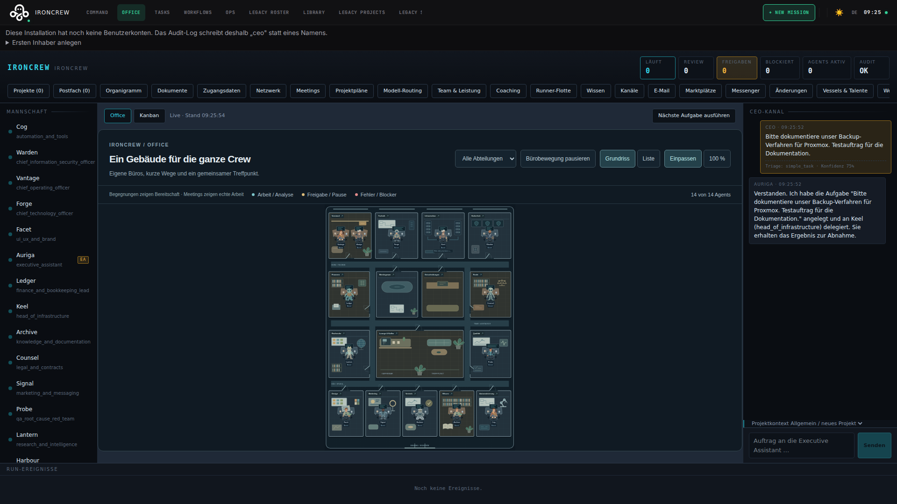
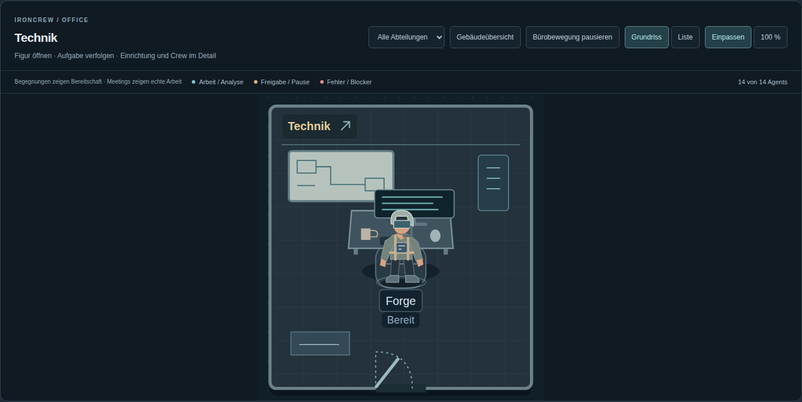
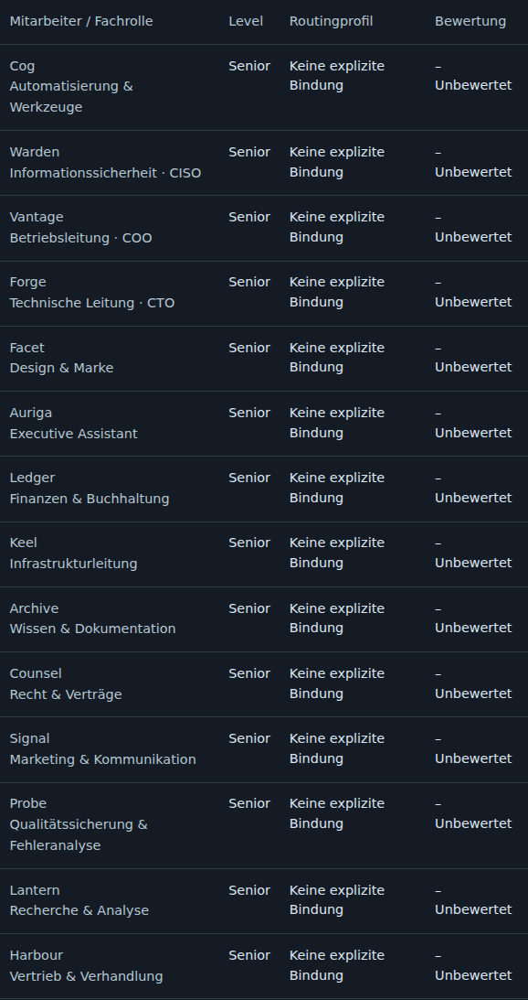
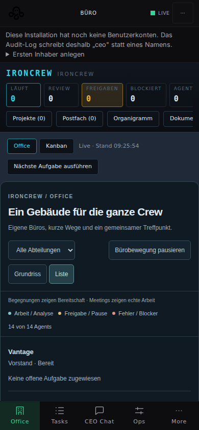
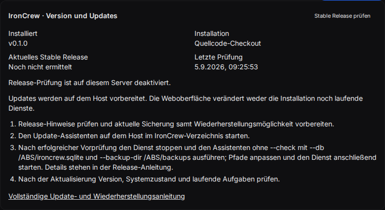

# IronCrew

**Deine virtuelle AI-Firma. Ein Ansprechpartner, eine Crew und ein gemeinsamer Arbeitsstand.**

IronCrew ist ein selbst gehostetes Multi-Agent-Company-OS für Linux und macOS.
Du bist der CEO. Dein Executive Assistant nimmt Aufträge entgegen, plant und
delegiert sie. Fachagenten bearbeiten die Aufgaben; Ergebnisse, Reviews,
Freigaben und Kosten bleiben nachvollziehbar.

[Erste Schritte](docs/GETTING_STARTED.md) · [Bedienung](docs/USER_GUIDE.md) ·
[Dokumentation](docs/README.md) · [Releases](https://github.com/irongeeks/ironcrew/releases) ·
[Installation und Updates](docs/RELEASES.md)



*Browseraufnahme aus der isolierten Testinstallation: originale Seed-Crew und ein
gekennzeichneter Dokumentationsauftrag. Die Bilder zeigen keine produktive Firma
und belegen keine Ausführung mit einem echten Providerkonto.*

## Version 0.1.0

IronCrew beginnt seine eigene Produktversionierung bei **0.1.0**. Die zuvor
veröffentlichte `2.8.0` folgte noch der übernommenen Versionsreihe. Sie bleibt
als historische Veröffentlichung erhalten; die Weiterentwicklung läuft ab jetzt
über `0.1.x` und spätere Versionen.

**Bereits 2.8.0 installiert?** Verwende den
[einmaligen Versionswechsel](docs/RELEASES.md#wechsel-von-280-auf-010).
Der alte Updater kennt diesen Übergang noch nicht. Die Datenbank wird dabei
nicht auf einen früheren Stand zurückgesetzt.

`0.1.0` bezeichnet einen frühen Entwicklungsstand mit getesteten Kernabläufen.
Ein vollständiger automatisierter Betrieb deines Geschäfts ist damit nicht zugesichert.
Den konkreten Umfang und die verbleibenden Grenzen dokumentieren
[Implementierungsstand](IMPLEMENTATION_STATUS.md) und
[Master-Prompt-Abdeckung](docs/MASTER_PROMPT_COVERAGE.md).

## Was du damit machen kannst

| Bereich | Funktionen |
| --- | --- |
| **CEO und Aufgaben** | EA-Chat, Projektplanung mit Freigabe, persistente Tasks, Abhängigkeiten, Kanban, Ergebnisse und Revisionen |
| **Lebendiges Office** | Unterschiedlich eingerichtete Abteilungsbüros, Flure, Lounge, Meetings, Raumfokus und Figuren mit echten Agentenzuständen |
| **Mitarbeiter** | Getrennte Fachrolle, Junior/Senior/Lead-Level, Modellprofil, Berechtigungen und visuelle Figur |
| **Delegation und Qualität** | Leads verteilen neue Aufgaben und bewerten Arbeit mit 1–5 Sternen; Verlauf, Anzahl und Mittelwert je Mitarbeiter und tatsächlich verwendetem Modell |
| **Runtimes** | MockRuntime sowie Adapter für Claude Code, Codex, Antigravity und OpenRouter; Health, Streaming, Abbruch, Rate-Limit-Queue und Recovery |
| **Governance** | Technische Freigabegates, Budgets, atomare Task-Claims, Vendor-Policy und prüfbarer Audit-Trail |
| **Wissen und Integrationen** | Obsidian-kompatibler Vault, optional Honcho, Tools/MCP, Mail und Business-Packs; der Umfang einzelner Adapter ist dokumentiert |
| **Betrieb** | Nativ oder Docker Compose, nativer Host-Runner, versionierte Releases, Sicherungen und Wiederherstellung |

Die Lead-Steuerung wird pro Abteilung eingerichtet und ausdrücklich aktiviert.
Sterne sind Modellreviews mit Arbeitsbelegen, keine objektiven Benchmarks.
[Team und Leistung](docs/CAREER_REVIEWS.md) erklärt die Auswertung.

## Ein Auftrag durch die Firma

1. Du beschreibst das gewünschte Ergebnis im CEO-Chat.
2. Der EA triagiert den Auftrag. Größere Projekte erhalten einen Plan zur Freigabe.
3. Aufgaben werden an passende Fachagenten delegiert; bei aktivierter
   Abteilungssteuerung übernimmt der Lead die Verteilung.
4. Runs liefern Live-Events, Arbeitsprodukte und ihren tatsächlichen Status.
5. Ergebnisse gehen ins Review. Du kannst sie annehmen oder eine Revision anfordern.
6. Aufgaben, Nachrichten, Entscheidungen und Audit bleiben nach einem Neustart erhalten.

[Der erste Auftrag](docs/GETTING_STARTED.md) ·
[Projektplanung](docs/PROJECT_PLANNING.md) · [Modellrouting](docs/RUNTIME_ROUTING.md)

## Ein Blick in IronCrew

**Abteilungsbüro im Raumfokus.** Einrichtung und Arbeitsplätze unterscheiden sich
je nach Fachbereich. Bereitschaftsbewegungen und Gesprächsgesten kosten keine
Modellaufrufe; echte Arbeit und Meetings haben Vorrang.



**Team und Leistung.** Level, Fachrolle, Modellprofil und Bewertungen bleiben
getrennt. Die neue Testfirma zeigt ehrlich „Unbewertet“, bis Arbeits- und Review-Runs vorliegen.



<details>
<summary>Mobile Ansicht und Versionsverwaltung</summary>

Auf kleinen Bildschirmen steht dieselbe Crew als bedienbare Liste bereit.



Die Einstellungen zeigen Version und Updateweg. Die externe Release-Prüfung
ist in dieser isolierten Aufnahme bewusst deaktiviert.



</details>

Du kannst **20 originale Figuren** zuweisen oder eigene private Medien hochladen.
Ein kopierbarer Generator-Prompt hilft bei der Erstellung in deinem Bildmodell.
[Figuren und private Assets](docs/CHARACTERS.md) · [Office-Bedienung](docs/LIVING_OFFICE.md)

Aufnahmeverfahren, Herkunft und Reproduktion: [Screenshot-Dokumentation](docs/SCREENSHOTS.md).

## Lokal starten

Voraussetzungen: **Node.js 22+**, Git und die in `package.json` festgelegte
**pnpm-Version 10.30.1**. Native Abhängigkeiten können Compilerwerkzeuge benötigen.

```bash
git clone --branch v0.1.0 https://github.com/irongeeks/ironcrew.git
cd ironcrew
corepack pnpm install --frozen-lockfile
cp .env.example .env
```

Trage eigene zufällige Werte für `OAUTH_ENCRYPTION_SECRET` und `API_AUTH_TOKEN`
in `.env` ein. Der [Schnellstart](docs/GETTING_STARTED.md) führt dich durch die
Konfiguration. Nutze für den ersten lokalen Versuch MockRuntime; dafür ist kein
Providerkonto erforderlich.

```bash
corepack pnpm dev:local
# Web: http://127.0.0.1:8800 · API: http://127.0.0.1:8790
```

Falls Corepack nicht installiert ist, installiere pnpm in der oben angegebenen
Version und verwende `pnpm` anstelle von `corepack pnpm`.
`pnpm dev` bindet den Entwicklungsserver an alle Interfaces;
`dev:local` bleibt auf dem lokalen Rechner.

**Dauerbetrieb:** [Linux](docs/LINUX_INSTALL.md) · [macOS](docs/MACOS_INSTALL.md) ·
[Docker und Updates](docs/RELEASES.md) · [Native Runner](docs/RUNNER_PROTOCOL.md)

CLI-Logins bleiben beim nativen Runner unter dessen Betriebssystemkonto.
Ein Container erhält dafür keinen Zugriff auf dein gesamtes Home-Verzeichnis.
Echte CLI-Starts mit deinem Konto prüfst du anhand der
[Runtime-Abnahme](docs/CLI_RUNTIME_ACCEPTANCE.md).

## Entwickeln und testen

```bash
corepack pnpm lint
corepack pnpm test
corepack pnpm build
corepack pnpm exec playwright install --with-deps chromium
corepack pnpm test:e2e
```

Die GitHub-Prüfungen decken Frontend, Backend, Skripte, Browser sowie Linux,
macOS und Docker ab. Screenshots werden in einer separaten Testfirma erzeugt.
Aktuelle Ergebnisse: [CI](https://github.com/irongeeks/ironcrew/actions/workflows/ci.yml) ·
[Plattformprüfung](https://github.com/irongeeks/ironcrew/actions/workflows/platform-production.yml).

## Dokumentation und Herkunft

Der [Docs-Index](docs/README.md) bündelt Bedienung, Konfiguration, Betrieb,
Architektur, Sicherheit und Entwicklung. Für Updates lies zusätzlich die
[Release-Hinweise](docs/releases/README.md) und den [Changelog](CHANGELOG.md).

IronCrew baut auf [OctoOffice](https://github.com/Chepko932/OctoOffice) auf.
OneManCompany und Paperclip dienen als konzeptionelle Referenzen für Firmenmodell
und Governance. Honcho bleibt eine optionale externe Memory-Integration.

Lizenz: **Apache-2.0**. Copyright- und Lizenzhinweise bleiben erhalten.
Details: [LICENSE](LICENSE) · [THIRD_PARTY_NOTICES.md](THIRD_PARTY_NOTICES.md) ·
[Upstream-Analyse](docs/UPSTREAM_ANALYSIS.md).
