<p align="center">
  
  
</p>

<p align="center">
  A local-first orchestrator that turns CLI coding agents into a fully simulated<br>
  virtual software company — with departments, meetings, workflows, and a<br>
  pixel-art office you can watch them work in.
</p>

<p align="center">
  
  <a href="https://github.com/Chepko932/OctoOffice/actions/workflows/ci.yml"></a>
  
  
  
</p>

<p align="center">
  <a href="#quick-start">Quick Start</a>&nbsp;&nbsp;&middot;&nbsp;&nbsp;
  <a href="#how-it-works">How It Works</a>&nbsp;&nbsp;&middot;&nbsp;&nbsp;
  <a href="#features">Features</a>&nbsp;&nbsp;&middot;&nbsp;&nbsp;
  <a href="#workflow-packs">Workflow Packs</a>&nbsp;&nbsp;&middot;&nbsp;&nbsp;
  <a href="#screenshots">Screenshots</a>&nbsp;&nbsp;&middot;&nbsp;&nbsp;
  <a href="#provider-setup">Providers</a>&nbsp;&nbsp;&middot;&nbsp;&nbsp;
  <a href="#messenger-integration">Messenger</a>&nbsp;&nbsp;&middot;&nbsp;&nbsp;
  <a href="#tech-stack">Tech Stack</a>&nbsp;&nbsp;&middot;&nbsp;&nbsp;
  <a href="#security">Security</a>&nbsp;&nbsp;&middot;&nbsp;&nbsp;
  <a href="docs/releases/v2.7.0.md">Release Notes</a>
</p>

---

<p align="center">
  <a href="docs/office-demo.mp4">
    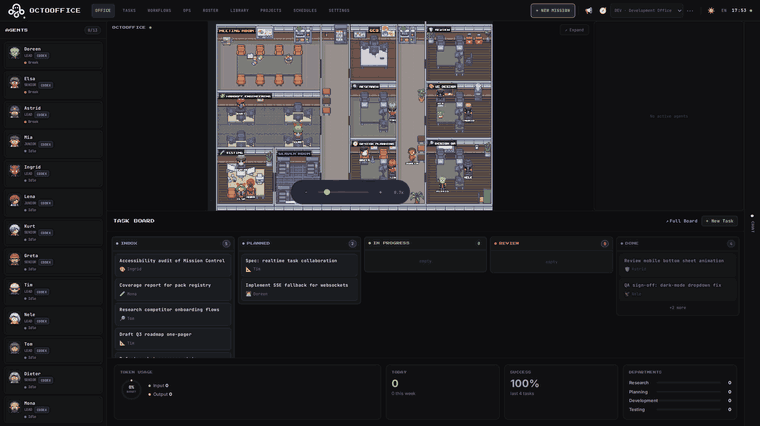
  </a>
  <br />
  <em><a href="docs/office-demo.mp4">&#9654;&nbsp;Watch the full-quality video</a></em>
</p>

---

<div align="center">

## What is OctoOffice?

OctoOffice connects your AI coding assistants — **Claude Code, Codex CLI, Gemini CLI,
OpenCode, OpenClaw, GitHub Copilot, Antigravity**, or any LLM API — and organizes them
into a virtual software company. You give orders as the CEO. They collaborate across
departments, execute multi-phase workflows, and deliver results — all from a single dashboard.

> **Local-first & private** — Everything runs on your machine. SQLite database, no cloud dependency, no data leaves your network.

</div>

<div align="center">

### Why OctoOffice?

**One dashboard, many agents** — Stop juggling terminals. Manage all your AI providers from MissionControl.

**Real autonomous collaboration** — Agents work in isolated git worktrees, attend planning meetings, and hand off work across departments.

**Declarative workflows** — Define multi-phase pipelines in YAML. The graph runner handles sequencing, connector dispatch, and phase advancement.

**Visual & transparent** — A pixel-art retro office shows what every agent is doing. Live terminal output. Real-time WebSocket updates.

**Talk from anywhere** — Send directives via Telegram, Discord, Slack, or WhatsApp. Approve decisions without opening the browser.

</div>

---

<a id="how-it-works"></a>

<div align="center">

## How It Works


<br><br>

**1.** You give a directive — type `$ Build a REST API` in the chat or send it via Telegram

**2.** CEO analyzes & delegates — the orchestrator parses your request and creates a task

**3.** Team leader assigns — the department's team leader picks the best-fit agent

**4.** Agent executes in isolation — each agent works in its own git worktree

**5.** Phases advance automatically — the graph runner moves through the workflow pack's DAG

**6.** You review & decide — approve, request changes, or let the CEO route follow-ups

</div>

---

<div align="center">

### CEO Orchestrator (Autonomous Mode)

When enabled, the CEO Orchestrator runs on a periodic tick and autonomously
reviews your inbox, creates tasks from messages, approves completed reviews,
rebalances workloads, and reprioritizes queues.
Conservative by design — max 3 decisions per tick, only acts on clear signals.

</div>

<div align="center">

### CEO Follow-Up Routing

When you submit follow-up feedback, the CEO makes an intelligent routing decision:

|      Decision      |            When            |                         Effect                          |
| :----------------: | :------------------------: | :-----------------------------------------------------: |
|   **Supplement**   | Small fix or clarification | Routes to the best-fit agent (may differ from original) |
| **Pipeline Reset** |     Significant rework     |      Resets workflow phases from a specified point      |
|    **New Task**    |        Out of scope        |  Creates a separate linked task with its own pipeline   |

</div>

<div align="center">

### Direct Agent Chat

Send a message **without** `$` to talk directly to a specific agent.
Requires a session mapping (messenger channel → agent). The agent responds in the same channel.

</div>

---

<a id="quick-start"></a>

<div align="center">

## Quick Start

### Prerequisites

|    Tool     | Version |                Install                 |
| :---------: | :-----: | :------------------------------------: |
| **Node.js** |  >= 22  |   [nodejs.org](https://nodejs.org/)    |
|  **pnpm**   | latest  | `corepack enable` (built into Node.js) |
|   **Git**   |   any   |  [git-scm.com](https://git-scm.com/)   |

</div>

<p align="center">
  <em>Typical setup time: 3–8 minutes on Linux/macOS with Node 22+ and pnpm already installed; 5–15 minutes via Docker.</em>
</p>

<div align="center">

### One-Command Install

**macOS / Linux**

</div>

```bash
git clone https://github.com/Chepko932/OctoOffice.git && cd OctoOffice && bash install.sh
```

<div align="center">

**Windows (PowerShell)**

</div>

```powershell
git clone https://github.com/Chepko932/OctoOffice.git; cd OctoOffice; powershell -ExecutionPolicy Bypass -File .\install.ps1
```

<div align="center">

### Start

</div>

```bash
pnpm dev          # Web UI on :8800, API on :8790 (binds 0.0.0.0, network-accessible)
# or
pnpm dev:local    # Same, but loopback only (127.0.0.1)
```

<p align="center">
  Open <strong>http://127.0.0.1:8800</strong> — done.
</p>

<details>
<summary><p align="center"><b>Manual setup</b></p></summary>

```bash
corepack enable
pnpm install
cp .env.example .env
# Generate OAUTH_ENCRYPTION_SECRET and INBOX_WEBHOOK_SECRET (32-byte hex each)
node -e "const fs=require('fs'),c=require('crypto'),g=()=>c.randomBytes(32).toString('hex');let e=fs.readFileSync('.env','utf8').replace(/^OAUTH_ENCRYPTION_SECRET=.*$/m,\`OAUTH_ENCRYPTION_SECRET=\${g()}\`).replace(/^INBOX_WEBHOOK_SECRET=.*$/m,\`INBOX_WEBHOOK_SECRET=\${g()}\`);fs.writeFileSync('.env',e)"
pnpm run setup -- --port 8790
pnpm dev
```

</details>

<details>
<summary><p align="center"><b>Install with AI</b></p></summary>

<p align="center">Paste this to your coding agent:</p>

```
Install OctoOffice following the guide at:
https://github.com/Chepko932/OctoOffice
```

</details>

<div align="center">

### Docker

No local Node.js required — just Docker:

</div>

```bash
git clone https://github.com/Chepko932/OctoOffice.git && cd OctoOffice
cp .env.example .env

# Generate OAUTH_ENCRYPTION_SECRET and INBOX_WEBHOOK_SECRET in one shot
node -e "const fs=require('fs'),c=require('crypto'),g=()=>c.randomBytes(32).toString('hex');let e=fs.readFileSync('.env.example','utf8').replace(/^OAUTH_ENCRYPTION_SECRET=.*$/m,\`OAUTH_ENCRYPTION_SECRET=\${g()}\`).replace(/^INBOX_WEBHOOK_SECRET=.*$/m,\`INBOX_WEBHOOK_SECRET=\${g()}\`);fs.writeFileSync('.env',e)"

docker compose --profile prod up --build    # Production (all on :8790)
docker compose --profile dev up --build     # Development (Vite :8800, API :8790)
```

<p align="center">
  All CLI providers are pre-installed in the image. SQLite persisted to a Docker volume.
</p>

<div align="center">

**Remote access (Tailscale / LAN)** — set `BIND_HOST` in `.env` to bind ports to a non-loopback IP:

</div>

```bash
# .env
BIND_HOST="100.x.x.x"   # your Tailscale IP, or 0.0.0.0 for every interface
```

<p align="center">
  Default is <code>127.0.0.1</code> (localhost only). Combined with the login password in
  <strong>Settings → General → Remote Access</strong>, this gives you encrypted remote access over Tailscale.
</p>

---

<a id="features"></a>

<div align="center">

## Features

</div>

<div align="center">

### MissionControl Dashboard

The home view — a 3-column layout with an agent sidebar (sprite avatars, token usage),
an embedded pixel-art office canvas with MiniKanban and metrics, and a real-time chat
panel supporting task conversations, announcements, reports, and CEO directives.

</div>

<div align="center">

### Pixel-Art Office

A Tiled-map-based 2D office rendered with Pixi.js 8. Agents walk between desks,
attend meetings, and work across 7 department rooms. Supports light and dark themes
with `Press Start 2P` pixel font and `JetBrains Mono` for data. Expandable to fullscreen.

</div>

<div align="center">

### Kanban Task Board

Full task lifecycle — Inbox → Planned → In Progress → Review → Done — with
drag-and-drop, pack-aware phase views, filters, and batch operations.

</div>

<div align="center">

### Visual Node Editor

Four modes in one:

|      Mode      |                                Purpose                                |
| :------------: | :-------------------------------------------------------------------: |
| **Visualizer** |                Read-only graph of any pack's phase DAG                |
|  **Monitor**   |     Live execution overlay — watch phases turn green in real time     |
|   **Editor**   |      Drag-to-connect ports, property panel, YAML preview + save       |
|  **Builder**   | Create new packs from scratch with a node palette and guidance editor |

Built with React Flow. Node types from the registry appear in the palette, grouped by category.

</div>

<div align="center">

### AI Provider Support

**CLI Providers** — Claude Code · Codex CLI · Gemini CLI · OpenCode · OpenClaw · GitHub Copilot · Antigravity

**API Providers** — OpenAI · Anthropic · Google · Ollama · OpenRouter · Together · Groq · Cerebras

**OAuth** — GitHub & Google with AES-256-GCM encrypted token storage

</div>

<div align="center">

### Messenger Integration

Full bidirectional messaging with **Telegram** and **Discord** (built-in receivers).
Outbound support for **Slack**, **WhatsApp**, **Google Chat**, **Signal**, and **iMessage**.
Send `$` directives, approve decisions, and receive live updates — all from your phone.

</div>

<div align="center">

### Decision Inbox

When agents need approval, they send numbered option lists to your messenger:

```
📋 Decision Required: Code Review for auth-refactor
1. Approve and merge
2. Request changes
3. Reject
→ Reply with the option number.
```

Works in the Web UI and all connected messenger channels. Multi-language responses supported.

</div>

<div align="center">

### CEO Directives & Routing

|             Prefix             |                      Effect                      |
| :----------------------------: | :----------------------------------------------: |
|      `$ Build a REST API`      | Broadcast to all agents, delegated via Planning  |
| `$ @design @qa Redesign login` | Targeted — specific departments receive the task |
|      `Fix the null check`      |    Direct chat with the session-mapped agent     |
|        `1` or `approve`        |   Decision reply — approves the pending action   |

</div>

<div align="center">

### Git Worktree Isolation

Every agent works in its own isolated git worktree and branch.
No conflicts between parallel agents. Merges happen only on CEO approval.

### Obsidian Knowledge Base

Bidirectional sync with local Obsidian vaults. Before task execution, vault files
are copied into the agent's worktree. After execution, changes sync back.

### Skills Library

Categorized skills library with custom skill upload and classroom-style training.
Assign skills to agents to specialize their capabilities.

### Server Management

Register external servers with health checks, resource allocation, and queue processing.

### In-App Updates

Auto-detect new GitHub releases with guided update instructions — never miss a version.

### Mobile Responsive

Dedicated mobile components for phones and tablets: collapsible office canvas
with pinch-to-zoom, vertical Kanban, bottom-sheet modals, and 44px touch targets.

### Multi-Language UI

English · Korean · Japanese · Chinese · German

### MCP Integration

OctoOffice acts as an MCP client — connect to external MCP servers and their tools
are automatically available to all agents. Supports `stdio` and `sse` transports.

### Node Type System

Reusable workflow building blocks that run server-side TypeScript — no agent spawn needed.
Built-in types: `echo`, `comfyui_generate`, `planning_meeting`, `cross_dept`.

### Remote Access

Password-protected remote access for Tailscale or similar setups.
Scrypt-hashed passwords, 7-day session tokens. Localhost remains password-free.

</div>

---

<a id="workflow-packs"></a>

<div align="center">

## Workflow Packs

Packs are declarative YAML files that define a phase DAG — the complete workflow
for a type of project. Each phase specifies its department, agent guidance,
dependencies, and execution mode.

**Execution modes:** `agent` (LLM executes) · `hybrid` (agent + connector guidance) · `server` (connector executes directly)

|           Pack           |  Key  |           Focus            |                         Departments                          |
| :----------------------: | :---: | :------------------------: | :----------------------------------------------------------: |
|     **Development**      | `DEV` |    Engineering baseline    | Research, Planning, Development, Testing, Review, Design, QA |
|    **Design Studio**     | `DSN` | UI design & design systems |  Design Planning, UI Design, Design QA, Handoff Engineering  |
|     **Web Research**     | `WEB` |  Citation-first research   |         Research Strategy, Crawler Team, Fact Check          |
| **Video Pre-Production** | `VID` |   ComfyUI video pipeline   |       Creative Direction, Visual Production, Visual QA       |

Select packs in **Settings > General > Office Workflow Pack**.

**Create your own pack:**&nbsp; Copy the starter template and edit the YAML — zero code changes required.

```bash
cp -r server/packs/community/_template server/packs/community/my_pack
# Edit pack.yaml + guidance files, restart the server — done.
```

See the full [Community Pack Creation Guide](docs/creating-community-packs.md) for schema reference, guidance writing tips, and common patterns.

</div>

---

<a id="screenshots"></a>

<div align="center">

## Screenshots

</div>

<table>
<tr>
<td width="50%">
<p align="center"><strong>MissionControl (Dark)</strong><br><em>Agent sidebar, embedded pixel office, MiniKanban, and live chat</em></p>
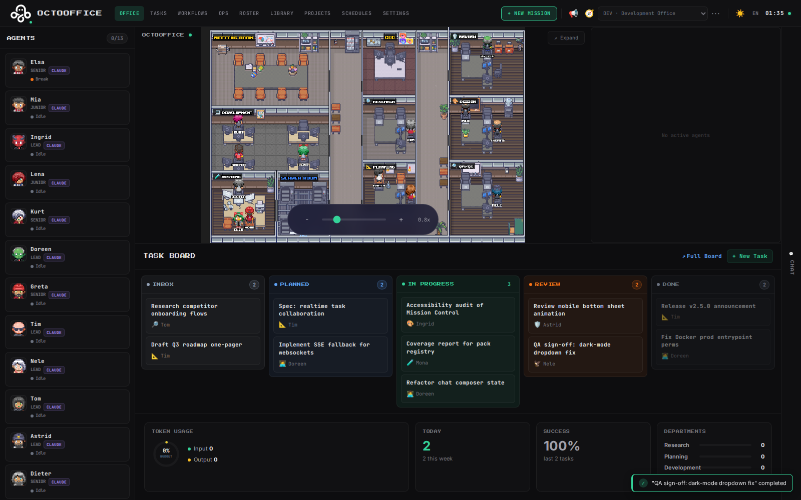
</td>
<td width="50%">
<p align="center"><strong>MissionControl (Light)</strong><br><em>Same layout with emerald accent on light background</em></p>
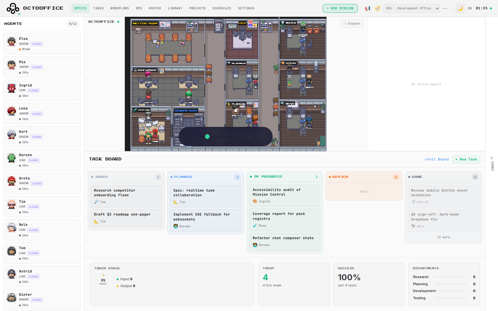
</td>
</tr>
<tr>
<td width="50%">
<p align="center"><strong>Visual Node Editor</strong><br><em>Phase DAG with live execution monitor and drag-to-connect editing</em></p>
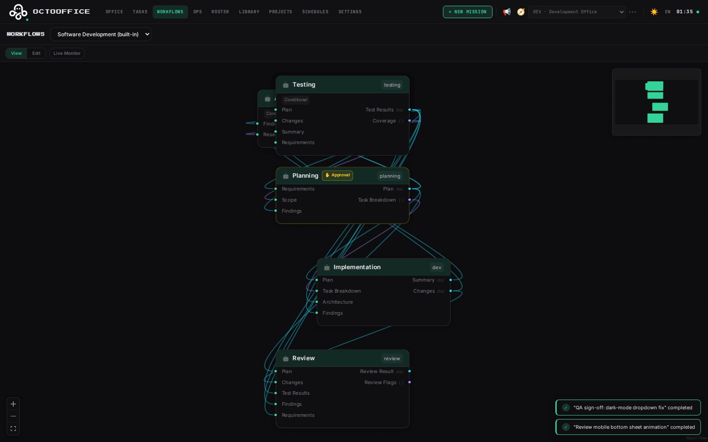
</td>
<td width="50%">
<p align="center"><strong>Kanban Board</strong><br><em>Drag-and-drop task management with filters and pack-aware phases</em></p>
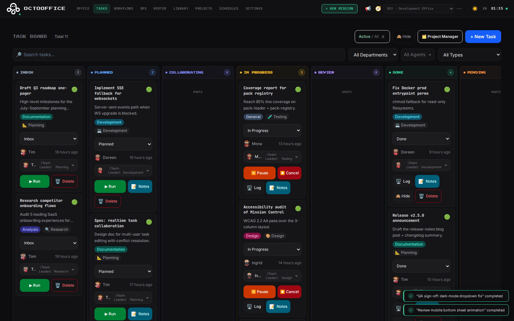
</td>
</tr>
<tr>
<td width="50%">
<p align="center"><strong>Agent Roster</strong><br><em>All agents with department filter, provider badge, and status indicators</em></p>
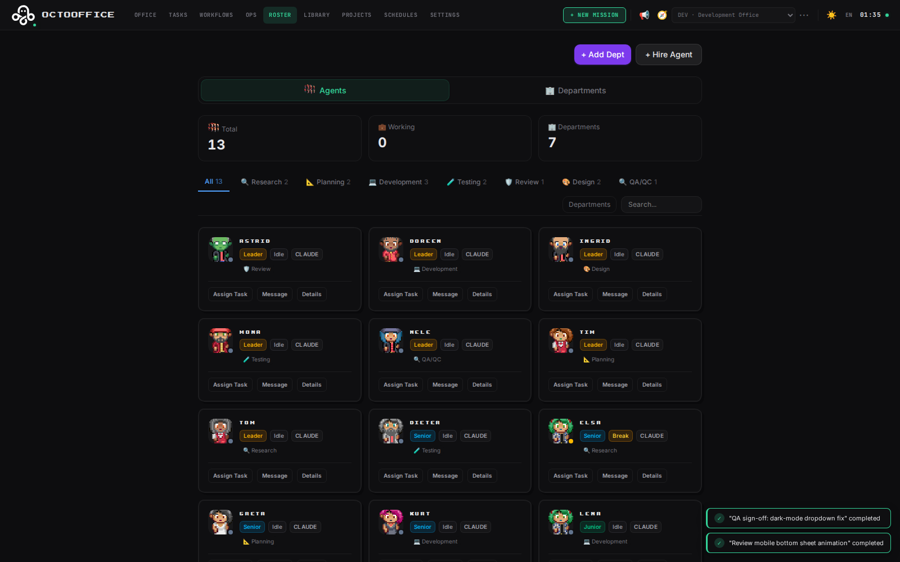
</td>
<td width="50%">
<p align="center"><strong>Settings</strong><br><em>CLI providers, API keys, messenger channels, workflow packs</em></p>
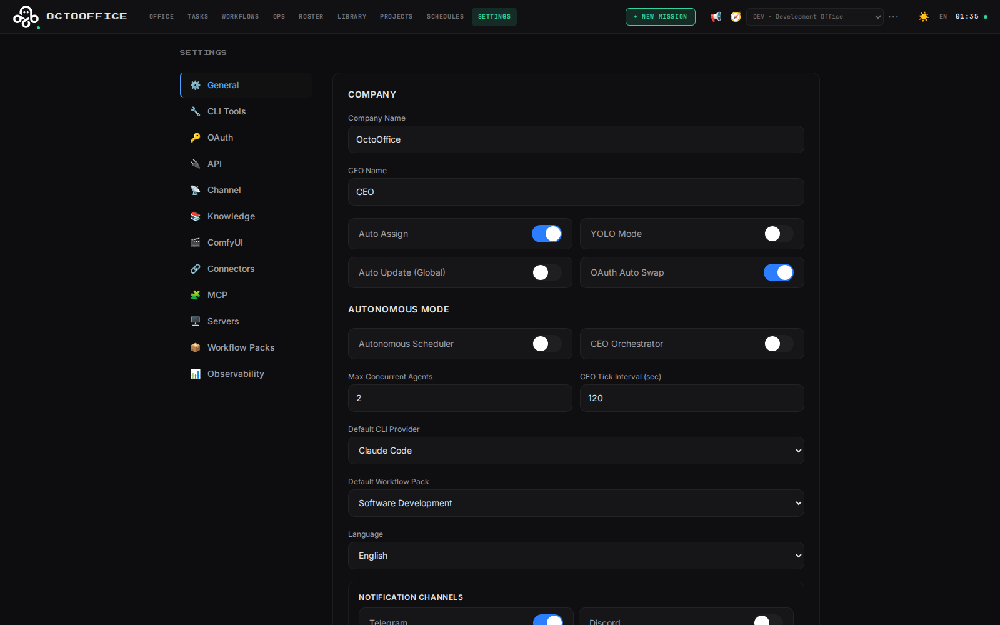
</td>
</tr>
</table>

### Onboarding

First launch walks you through a 5-step wizard — company/CEO identity, default CLI provider, optional extras, Obsidian knowledge base, and final sanity check.

<table>
<tr>
<td width="33%">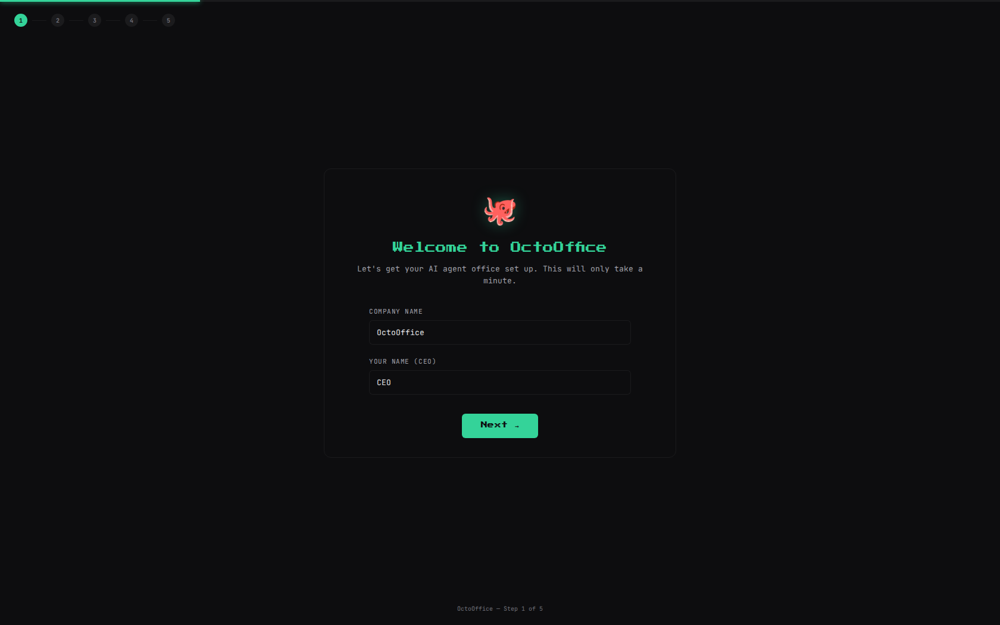</td>
<td width="33%">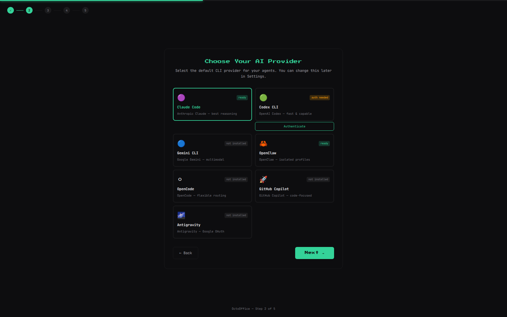</td>
<td width="33%">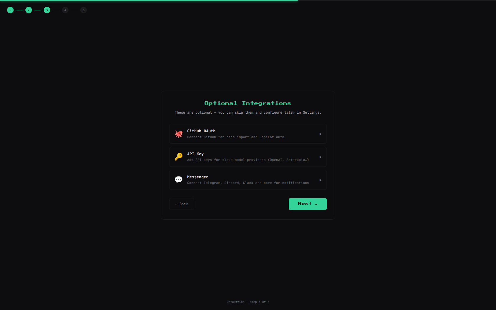</td>
</tr>
<tr>
<td width="50%">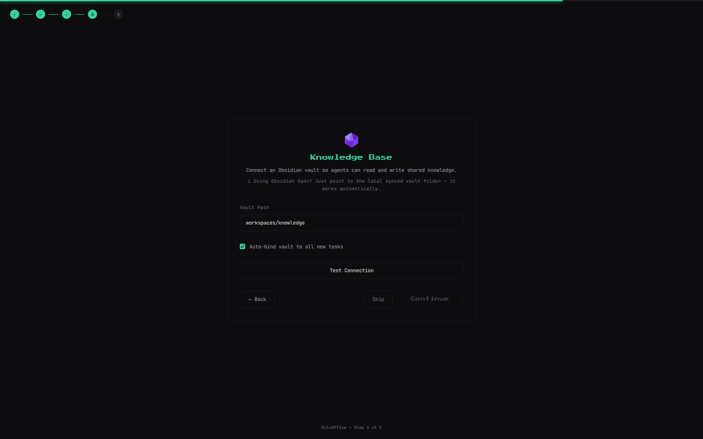</td>
<td width="50%">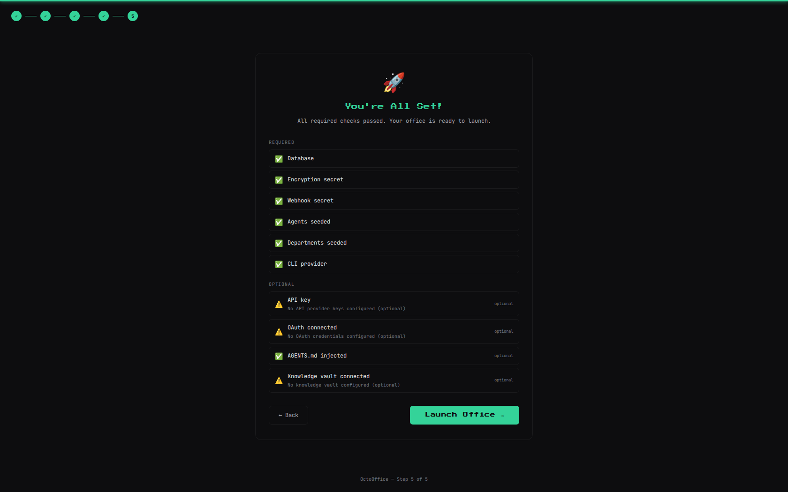</td>
</tr>
</table>

### Mobile

Full responsive layout for phones — 5-tab bottom navigation (Office, Tasks, Chat, Ops, More), slide-up bottom sheets, pinch-to-zoom office canvas, and 44px minimum touch targets throughout.

<table>
<tr>
<td width="20%">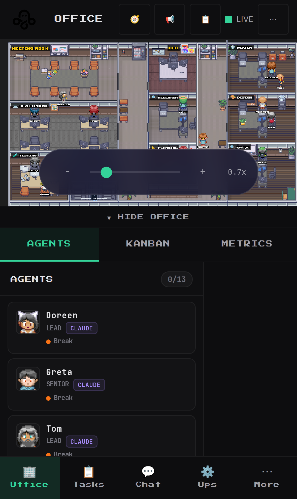</td>
<td width="20%">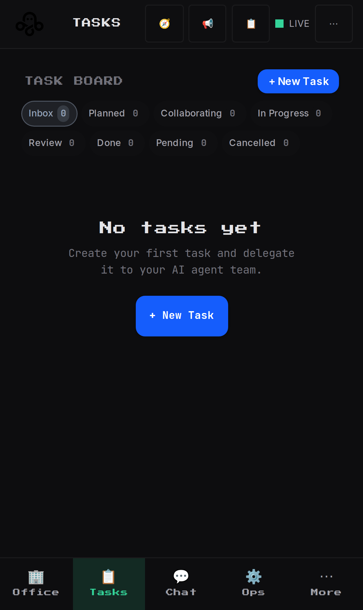</td>
<td width="20%">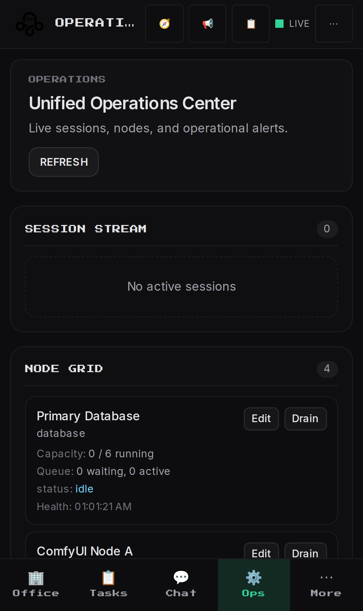</td>
<td width="20%">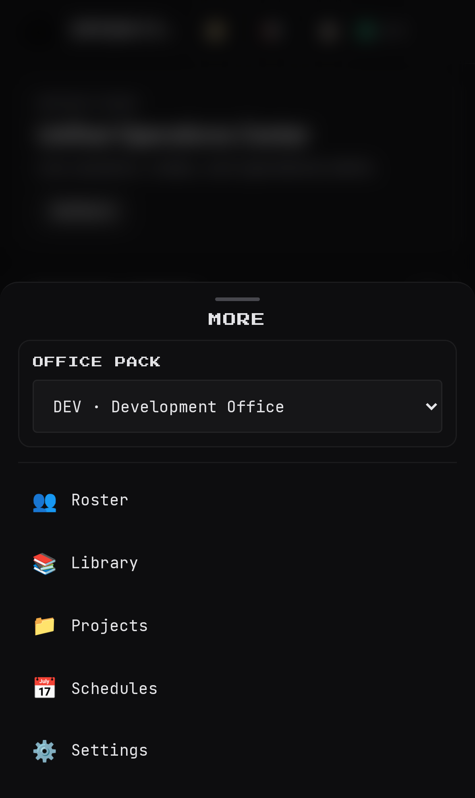</td>
<td width="20%">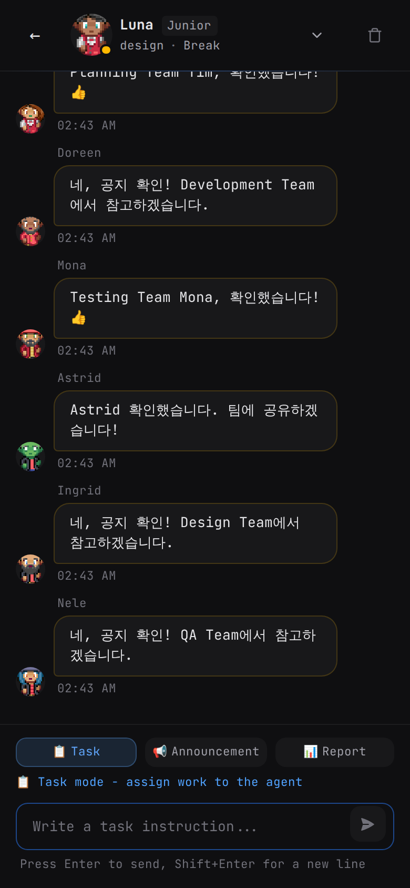</td>
</tr>
</table>

---

<a id="provider-setup"></a>

<div align="center">

## Provider Setup

OctoOffice supports three provider paths:

**CLI tools** — Local coding CLIs spawned as subprocesses
**OAuth accounts** — GitHub/Google-backed flows via secure token exchange
**API keys** — External LLM APIs configured in **Settings > API**

### CLI Providers

|                              Provider                              |                  Install                  |            Auth             |
| :----------------------------------------------------------------: | :---------------------------------------: | :-------------------------: |
|   [Claude Code](https://docs.anthropic.com/en/docs/claude-code)    |   `npm i -g @anthropic-ai/claude-code`    |  `claude` (follow prompts)  |
|            [Codex CLI](https://github.com/openai/codex)            |         `npm i -g @openai/codex`          | `OPENAI_API_KEY` in `.env`  |
|     [Gemini CLI](https://github.com/google-gemini/gemini-cli)      |       `npm i -g @google/gemini-cli`       |     OAuth via Settings      |
|        [OpenCode](https://github.com/opencode-ai/opencode)         |            `npm i -g opencode`            |      Provider-specific      |
|              [OpenClaw](https://docs.openclaw.ai/cli)              |            `npm i -g openclaw`            | Profile-based (`--profile`) |
|      [GitHub Copilot](https://github.com/github/copilot-cli)       | `npm i -g @githubnext/github-copilot-cli` |       `gh auth login`       |
| [Antigravity](https://github.com/antigravity-official/antigravity) |          `npm i -g antigravity`           |      Provider-specific      |

Configure providers and models in **Settings > CLI Tools**.

</div>

<details>
<summary><p align="center"><b>OpenClaw profile-based local LLM setup</b></p></summary>

<p align="center">
  OpenClaw supports per-agent profile isolation via <code>--profile &lt;name&gt;</code>.
  Each profile maintains its own config under <code>~/.openclaw-&lt;name&gt;/</code>.
</p>

```bash
openclaw --profile qwen config set agents.defaults.model.primary "vllm/qwen3.5-35b-moe"
openclaw --profile qwen config set tools.elevated.enabled true
```

<p align="center">
  Set an agent's provider to <strong>OpenClaw</strong> and enter the profile name in the dashboard.
</p>

</details>

---

<a id="messenger-integration"></a>

<div align="center">

## Messenger Integration

Configure channels in **Settings > Channel Messages**.

### Bidirectional (built-in receivers)

|   Channel    |   Protocol   |                         Requirements                          |
| :----------: | :----------: | :-----------------------------------------------------------: |
| **Telegram** | Long-polling | Bot token from [@BotFather](https://t.me/BotFather) + chat ID |
| **Discord**  |   Polling    |                    Bot token + channel ID                     |

### Outbound-only

|     Channel     |  Transport   |          Requirements          |
| :-------------: | :----------: | :----------------------------: |
|    **Slack**    |   Bot API    |     Bot token + channel ID     |
|  **WhatsApp**   |  Cloud API   | Access token + phone number ID |
| **Google Chat** |   Webhook    |          Webhook URL           |
|   **Signal**    |     RPC      |      Signal RPC base URL       |
|  **iMessage**   | macOS native |           macOS only           |

All tokens encrypted at rest (AES-256-GCM).

### Message Routing

|            You send             |                      What happens                      |
| :-----------------------------: | :----------------------------------------------------: |
| `$ Build a REST API for users`  | CEO directive — broadcast, delegated to best-fit agent |
| `$ @design @qa Redesign login`  |   Targeted directive — specific departments involved   |
| `Fix the null check in auth.ts` |         Direct agent chat via session mapping          |
|        `1` or `approve`         |        Decision reply — approves pending action        |
|             `/new`              |     Resets conversation history with mapped agent      |

</div>

<details>
<summary><p align="center"><b>Telegram setup example</b></p></summary>

<div align="center">

1. Create a bot via [@BotFather](https://t.me/BotFather) and copy the token
2. Go to **Settings > Channel Messages > Telegram**
3. Paste the bot token
4. Add a session: enter chat ID + select which agent receives messages
5. Enable **Receive** — polling starts automatically
6. Test: send `$ Hello from Telegram`

</div>

</details>

---

<a id="tech-stack"></a>

<div align="center">

## Tech Stack

|        Layer         |                   Technology                    |
| :------------------: | :---------------------------------------------: |
|     **Frontend**     | React 19, Vite 7, TailwindCSS 4, TypeScript 5.9 |
| **Pixel Art Engine** |                    Pixi.js 8                    |
|     **Backend**      |    Express 5, SQLite (embedded, zero-config)    |
|    **Real-time**     |                 WebSocket (ws)                  |
|    **Validation**    |                      Zod 4                      |
| **Workflow Editor**  |           React Flow (@xyflow/react)            |
|      **Icons**       |                  Lucide React                   |
|     **Routing**      |                 React Router 7                  |
|     **Testing**      |          Vitest 3, Playwright E2E, MSW          |

</div>

---

<div align="center">

## Project Structure

</div>

```
OctoOffice/
├── server/                     # Express backend
│   ├── packs/                  #   Declarative workflow packs (built-in + community)
│   ├── connectors/             #   Service connectors (ComfyUI, MCP, web-search)
│   ├── adapters/               #   CLI/HTTP provider adapters
│   ├── node-types/             #   Reusable workflow node types
│   ├── modules/                #   Routes, workflow engine, bootstrap
│   ├── security/               #   Auth, CORS, origin validation
│   └── messenger/              #   Chat infrastructure
├── src/                        # React frontend
│   ├── components/             #   25+ feature-based components
│   ├── hooks/                  #   WebSocket, polling, mobile hooks
│   └── styles/                 #   Tailwind, theme variables
├── tools/                      # Playwright MCP and design workflow tooling
├── tests/                      # Playwright E2E tests
├── docs/                       # Architecture, release notes, specs
├── scripts/                    # Setup & automation
└── public/                     # Sprites, maps, fonts, logos
```

---

<div align="center">

## Environment Variables

Copy `.env.example` to `.env`. Key variables:

|         Variable          |   Required   |                  Description                  |
| :-----------------------: | :----------: | :-------------------------------------------: |
| `OAUTH_ENCRYPTION_SECRET` |   **Yes**    | Encrypts OAuth/messenger tokens (AES-256-GCM) |
|  `INBOX_WEBHOOK_SECRET`   | For webhooks |        Shared secret for `/api/inbox`         |
|          `PORT`           |      No      |         Server port (default: `8790`)         |
|     `API_AUTH_TOKEN`      | Recommended  |   Bearer token for non-loopback API access    |
|         `DB_PATH`         |      No      | SQLite path (default: `./octooffice.sqlite`)  |

See [`.env.example`](.env.example) for all available variables.

</div>

---

<div align="center">

## Run Modes

</div>

```bash
pnpm dev           # Development, network-accessible (0.0.0.0)
pnpm dev:local     # Development, localhost only (127.0.0.1)
pnpm build         # Production build
pnpm start         # Production server
```

<div align="center">

### CI Pipeline

Runs on every PR: Unicode guard → install → format → lint → OpenAPI validation → type check → build → unit tests (with coverage) → Playwright E2E.

</div>

```bash
# Local pre-PR check
pnpm format:check && pnpm lint && pnpm build && pnpm test:ci
```

---

<a id="security"></a>

<div align="center">

## Security

**Local-first** — All data in SQLite, no external cloud services

**Encrypted tokens** — OAuth and messenger tokens encrypted at rest (AES-256-GCM)

**Localhost by default** — Dev server binds to `127.0.0.1`

**No secrets in repo** — `.gitignore` blocks `.env`, `*.pem`, `*.key`

**Preflight checks** — `pnpm run preflight:public` scans for leaked secrets

**Remote access** — Optional password protection with scrypt hashing for Tailscale setups

**Rate limits** — Login and API endpoints protected; loopback skipped by default (see [`SECURITY.md`](SECURITY.md#deployment-hardening-notes) before putting a reverse proxy in front)

**Report a vulnerability** — [GitHub Private Vulnerability Reporting](https://github.com/Chepko932/OctoOffice/security/advisories/new) (preferred, see [`SECURITY.md`](SECURITY.md) for details)

Security policy: [`SECURITY.md`](SECURITY.md) · API docs: [`docs/api.md`](docs/api.md) · OpenAPI spec: [`docs/openapi.json`](docs/openapi.json)

</div>

---

<div align="center">

## Troubleshooting

</div>

- **`EADDRINUSE` / port in use** — Free the port with `lsof -iTCP:8800 -sTCP:LISTEN` (then `kill <pid>`), or override via env: `PORT=8801 pnpm dev`. Web and API ports can also be set in `.env`.
- **Node version error** — Requires Node **>= 22**. Install via [nvm](https://github.com/nvm-sh/nvm): `nvm install 22 && nvm use 22`.
- **`OAUTH_ENCRYPTION_SECRET must be set` at startup** — Run the secret-generation snippet from the [Manual setup](#manual-setup) section, or the interactive wizard (`bash install.sh`).
- **`pnpm run setup` did not create `.env`** — `pnpm run setup` only injects AGENTS.md orchestration rules. Note: use `pnpm run setup`, not `pnpm setup` (the latter is a built-in pnpm command that does something else). Use `bash install.sh` (macOS/Linux) or `install.ps1` (Windows) for interactive first-time setup, or run the manual snippet above.
- **Local verification** — you can reproduce the CI pipeline locally with `pnpm format:check && pnpm lint && pnpm build && pnpm test`.

More: [`docs/`](docs/) · [`SECURITY.md`](SECURITY.md) · [`CONTRIBUTING.md`](CONTRIBUTING.md)

---

<div align="center">

## Contributing

1. Fork the repository
2. Create a feature branch from `dev` (`git checkout -b feature/amazing-feature`)
3. Run checks: `pnpm format:check && pnpm lint && pnpm build && pnpm test:ci`
4. Open a Pull Request to `dev`

Full guide: [`CONTRIBUTING.md`](CONTRIBUTING.md)

</div>

---

<div align="center">

## License

[Apache 2.0](LICENSE) — Free for personal and commercial use.

</div>

---

<div align="center">
  
  
  <br><br>
  <strong>OctoOffice — Where AI agents come to work.</strong>
</div>
