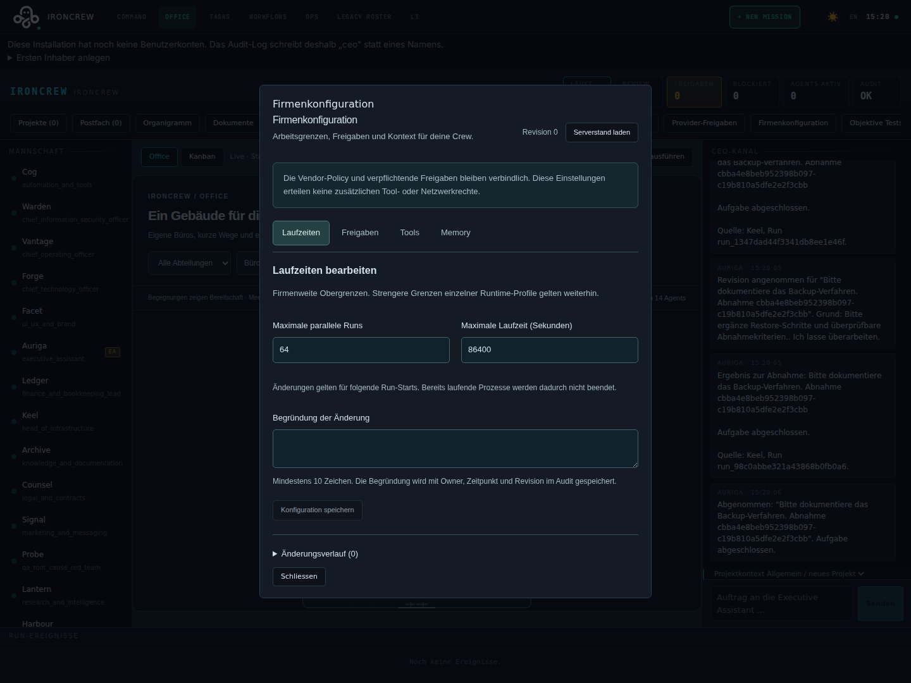

# Firmenkonfiguration

Unter **Command Center → Firmenkonfiguration** verwaltet der Owner die wirksamen
Arbeitsgrenzen seiner Firma. Es gibt vier Bereiche: **Laufzeiten**, **Freigaben**,
**Tools** und **Memory**. Die Oberfläche liest den gespeicherten Stand; Änderungen
werden erst mit **Konfiguration speichern** wirksam.

## Arbeitsgrenzen festlegen

| Bereich | Einstellung | Tatsächliche Wirkung |
| --- | --- | --- |
| Laufzeiten | Maximale parallele Runs, 1–64 | Zusätzliche firmenweite Kapazitätsgrenze; Task- und Meeting-Runs zählen mit. Strengere Runtime-/Vessel-Grenzen bleiben wirksam. |
| Laufzeiten | Maximale Laufzeit, 1–86.400 Sekunden | Zusätzliche Obergrenze beim Run-Start, auch bei gerouteten Meetings. Laufende Prozesse werden durch eine spätere Änderung nicht beendet. |
| Freigaben | Zusätzliche freigabepflichtige Tools | Registrierte Tool-Schlüssel können eine Freigabe benötigen. Eine Freigabe erteilt keine fehlenden Toolrechte. |
| Tools | Gesperrte Tools | Verweigert die Toolnutzung auch bei einem ansonsten vorhandenen Agenten-Grant. |
| Tools | Zusätzliche Freigaben nach Risikoklasse | Klassen Lesen, Schreiben und externe Aktion können zusätzlich freigabepflichtig werden. |
| Memory | Memory-Kontext für Runs verwenden | Schaltet das Hinzufügen gespeicherter Memory-Einträge zum Kontext kommender Runs ein oder aus. |
| Memory | Maximale Kontext-Einträge, 1–30 | Begrenzt die Zahl hinzugefügter Einträge; initial fünf. |
| Memory | Optionale semantische Suche verwenden | Steuert die explizite externe semantische Suche. Richtet Honcho nicht ein und schaltet dessen Synchronisierung nicht global ab. |

Ausgangswerte für die zusätzlichen Laufzeitgrenzen sind 64 Runs und 86.400 Sekunden;
die normalerweise strengeren konfigurierten Runtime-Grenzen gelten weiterhin.
Es werden initial keine Tools zusätzlich gesperrt und keine zusätzlichen
Freigabeklassen aktiviert. Memory-Kontext und optionale semantische Suche sind
initial erlaubt; ein externer Dienst benötigt unabhängig davon seine Einrichtung.

## Schutzregeln und Änderungen

Die Liste **Immer freigabepflichtig** ist unveränderlich. Sie umfasst beispielsweise
Bankaktionen, produktive Deployments, bindende Erklärungen, irreversible Änderungen,
Secrets-Ausgabe und Berechtigungsänderungen. Der Editor kann außerdem weder die
[Vendor-Policy](VENDOR_POLICIES.md) lockern noch Netzwerk- oder Sandboxrechte vergeben.
Secrets und externe Endpunkte werden hier nicht bearbeitet.

Jede Speicherung benötigt eine Begründung mit 10–1.000 Zeichen. Version,
Konfiguration, Actor, Zeit, Korrelation und Audit-Bezug werden gemeinsam persistiert.
Unter **Änderungsverlauf** sind frühere Werte und ihr Audit-Bezug einsehbar.

Bei einer parallelen Änderung verweigert der Server eine veraltete Revision mit
HTTP 409. Der Entwurf und seine Begründung bleiben erhalten. **Serverstand laden**
aktualisiert die Vergleichswerte. Anschließend kann der Owner den Entwurf verwerfen
oder ausdrücklich **Entwurf auf geladenem Stand weiterbearbeiten** wählen. Diese
Aktion speichert noch nichts; vor dem Speichern alle Werte erneut prüfen.

Nur ein bestätigter Owner beziehungsweise der ausdrücklich bestätigte lokale
Single-Owner-Bootstrap darf speichern. Fehlgeschlagene Authentifizierungsanfragen
werden nicht als Bootstrap-Freigabe behandelt. Andere angemeldete Rollen erhalten
eine Leseansicht. Die UI prüft sowohl die bestätigte Rolle als auch `canEdit` des
Servers; die API und der Store erzwingen die Berechtigung unabhängig davon.

## API und Nachweise

- `GET /api/crew/configuration`: Revision, Konfiguration, Historie, feste
  Freigabetypen, registrierte Toolauswahl und `canEdit`.
- `PUT /api/crew/configuration`: `{ baseRevision, reason, configuration }`, Owner
  und bestehender Session-/CSRF-Schutz erforderlich.
- [Gemeinsames Schema](../src/shared/company-configuration.ts),
  [Store](../server/ironcrew/policy/company-configuration-store.ts),
  [API](../server/ironcrew/api/company-configuration-routes.ts).
- [Storetests](../server/ironcrew/policy/company-configuration-store.test.ts),
  [API-Tests](../server/ironcrew/api/company-configuration-routes.test.ts),
  [UI-Tests](../src/ironcrew/ConfigurationPanel.test.tsx) und
  [Browserworkflow](../tests/e2e/flows/configuration.spec.ts).

Die Einstellungen wirken auf folgende Admission-/Tool-/Memory-Prüfungen. Sie
widerrufen keinen bereits an einen externen Provider gesendeten Request und löschen
kein gespeichertes Wissen. Die Änderung der Konfiguration ist kein Nachweis einer
erfolgreichen Live-Anbindung des gewählten Providers.

## Geprüfte Browseransicht

Version 0.3.0, isolierte Testfirma aus [CI 33974382581](https://github.com/irongeeks/ironcrew/actions/runs/33974382581). Keine persönlichen Konten oder produktiven Geschäftsdaten.
