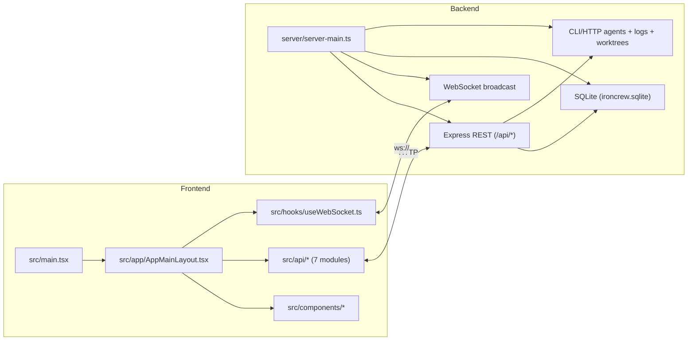
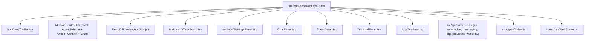
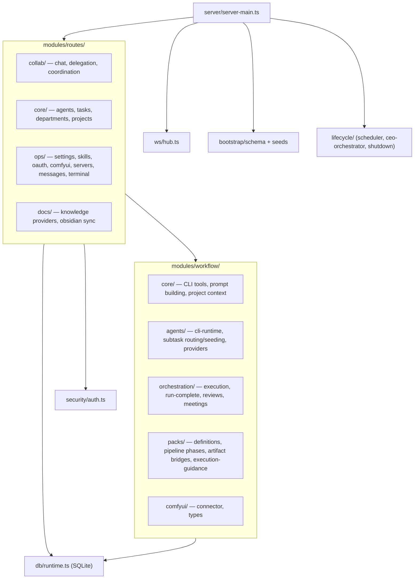
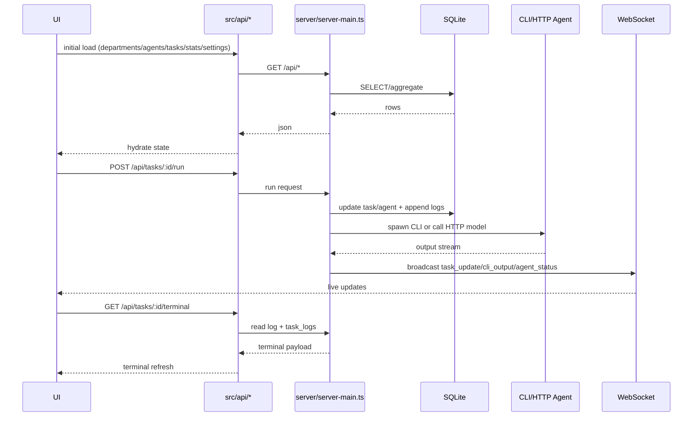

# CEO Structure Map

Generated from parallel architecture analysis lanes:

1. Frontend module map (`src/`)
2. Backend module map (`server/`)
3. Tooling/docs map (`scripts/`, `docs/`)
4. Build/config map (`package.json`, `tsconfig*`, `vite.config.ts`, `.env*`)
5. End-to-end runtime sequence (UI → API → DB/CLI → WS → UI)
6. Repository inventory (tree and key files)

## High-Level System Map



## Frontend Composition



## Backend Module Structure



## Core Runtime Sequence



## Key Files

- Runtime entry: `server/server-main.ts`, `src/main.tsx`, `src/app/AppMainLayout.tsx`
- API client modules: `src/api/core.ts`, `src/api/comfyui-workflows.ts`, `src/api/knowledge-docs.ts`, `src/api/messaging-runtime-oauth.ts`, `src/api/organization-projects.ts`, `src/api/providers-reports-github.ts`, `src/api/workflow-skills-subtasks.ts`
- Shared model types: `src/types/index.ts`
- Workflow packs: `server/modules/workflow/packs/definitions.ts`
- Pipeline orchestration: `server/modules/workflow/orchestration/run-complete-handler.ts`

## Refresh Commands

```bash
pnpm run arch:map
```
